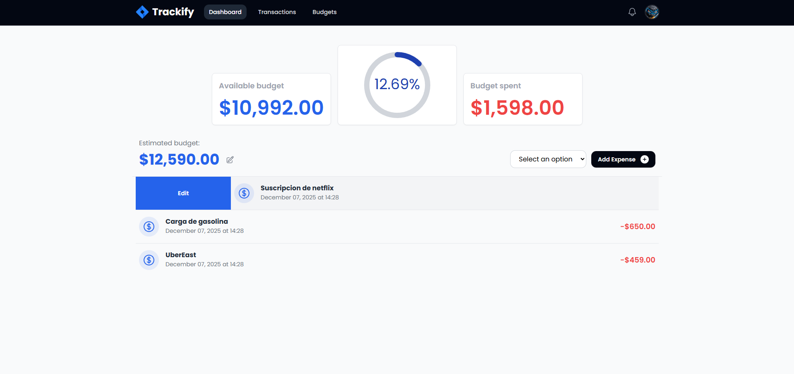

#  Trackify - Control de Finanzas Personales 

Trackify es una aplicación web moderna para administrar tus ingresos y gastos de manera sencilla, visual y eficiente.
Construida con React + TypeScript, utiliza ContextAPI + Reducer para un manejo global del estado, ofreciendo un rendimiento óptimo y una arquitectura escalable.

🔗 Demo en línea: https://trackify-mc.netlify.app/

🔗 Repositorio: https://github.com/Marcocruz01/trackify

## Características

- Registro de ingresos y gastos con categorías.
- Balance general actualizado en tiempo real.
- Estado global administrado con ContextAPI + Reducer.
- Rápida y ligera gracias a Vite.
- Libreria de HeadlesUI para animaciones y ventanas modales.
- Libreria de react-swipeable-list.
- Interfaz moderna hecha con Tailwind CSS.
- Diseño responsivo optimizado para móvil y escritorio.
- Persistencia local datos guardados en LocalStorage.
## Tech Stack

**Cliente:** 
- React.
- TypeScript.
- Vite.
- Tailwind CSS.
- ContextAPI + Redux.

## Autor

- [@Marcocruz01](https://github.com/Marcocruz01)

## Vista General
.
.
